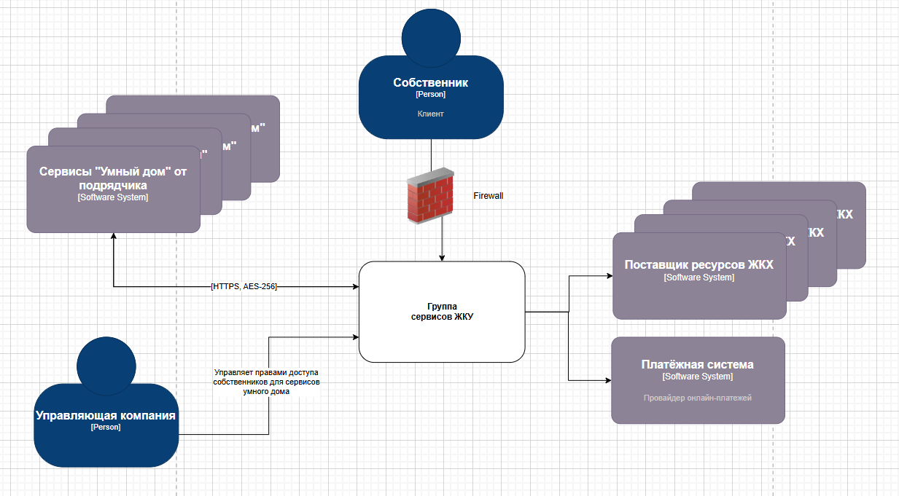
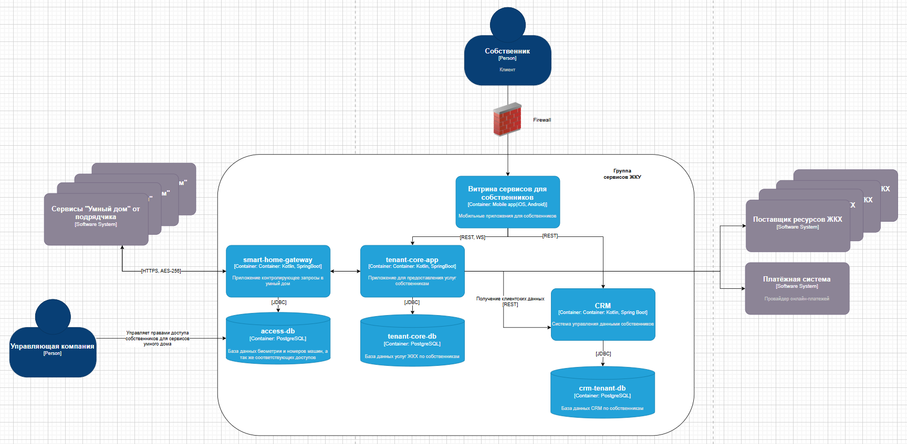

Диаграмма контекста - дорабатываем существующее мобильное приложение с использованием сервисов партнера:

Диаграмма контейнеров:

## Требования к безопасности

**Конфиденциальность данных:**

- Все передаваемые биометрические данные должны шифроваться (AES-256)
- Номера автомобилей передаются в хешированном виде (SHA-256)
- TLS 1.3 для всех внешних соединений
- Данные в хранилищах должны быть зашифрованы

**Целостность и доступность:**

- Реализовать механизмы повторных попыток при сбоях связи
- Валидация всех входящих данных от партнера
- Мониторинг доступности внешних API

**Соответствие законодательству:**

- Отдельное согласие на обработку биометрических данных (152-ФЗ)
- Логирование всех операций с биометрией
- Возможность полного удаления биометрических данных по требовани

## Протоколы аутентификации и авторизации

**Аутентификация между системами:**

- Mutual TLS (mTLS) для идентификации сторон
- JWT токены с коротким временем жизни (5-10 минут)

**Аутентификация пользователей:**

- Существующая аутентификация через auth-service-1
- MFA для операций управления доступом
- Сессионные токены с привязкой к устройству

## Взаимодействие между системами предприятия и внешней платформой

**Подготовка данных**

- Зашифровываем фото пользователя
- Зашифровываем номер машины
- Сохраняем данные в нашей защищенной базе

**Распознавание у двери**

- Камера у подъезда снимает человека → отправляет данные в систему распознавания
- Система сравнивает с "отпечатками" из базы
- Если совпадение → отправляет команду "открыть дверь"

**Управление через приложение**

- Собственник жмет кнопку в приложении "Открыть дверь"
- Команда идет через наши сервера к системе домофона
- Дверь открывается